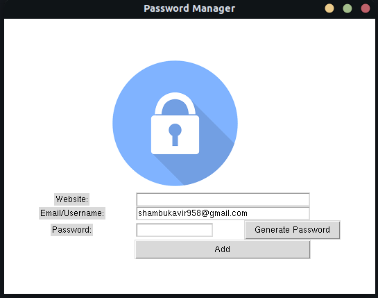

# Password-Manager

## Description
A password manager app which stores all your passwords in a txt file, and is also capable of generating strong passwords to keep hackers at bay.
<br />


## Installation
* Make sure that you have python3 installed in your system

* Install the tkinter module for python using pip <br />
      ```  pip install tk```  
* Install the following packages to use the copy to clipboard feature <br />
      ```  pip install pyclipper```             <br />
      ```  sudo apt-get install xclip```

* Clone this repository <br />
   ```  git clone https://github.com/Shambu-K/password-manager.git```
   
* Run the python file <br />
   ```  python3 main.py```
* Alternatively, you can generate the executable by running the following commands <br />
      ```  pip install pyinstaller``` <br />
      ```  pyinstaller --onefile -w main.py``` 
* The executable created will be present in the **dist** directory. Copy it to the main(**password-manager**) directory and launch it.

## Usage

* Enter the website name, your email ID, and password in the fields provided
* Click on the **Generate Password** button to generate a random password
* The generated password is automatically copied to your clipboard, so you can simply paste it while setting up new credentials in a particular website.
* Click on the **Add** button to save your authentication details
* In case,you miss any fields a dialogue box will pop up prompting you to fill all the fields
* Once you've filled all the details, the program will ask you to verify them before saving them in a file
